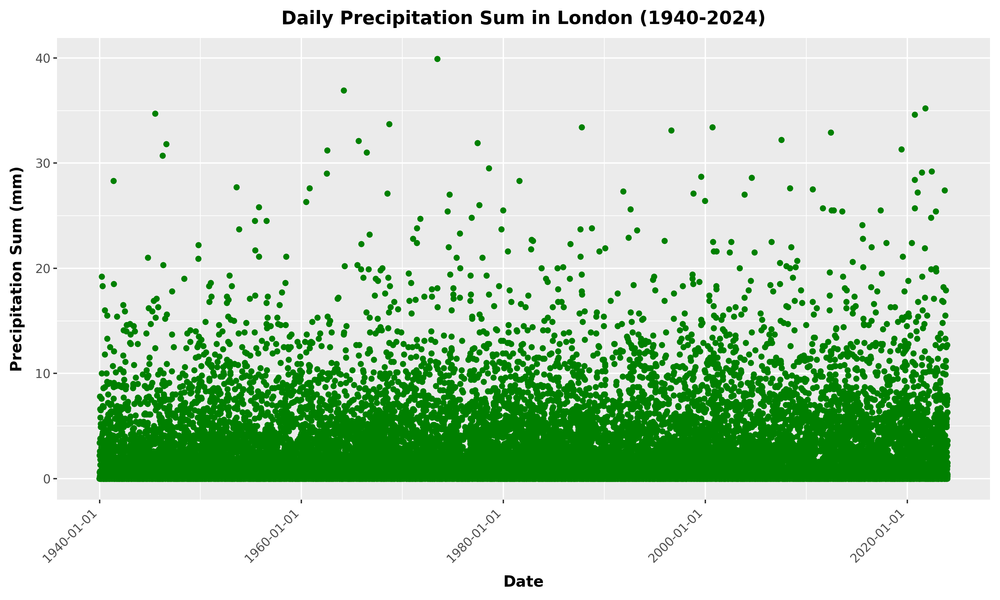
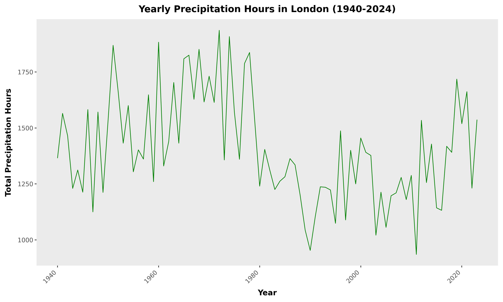
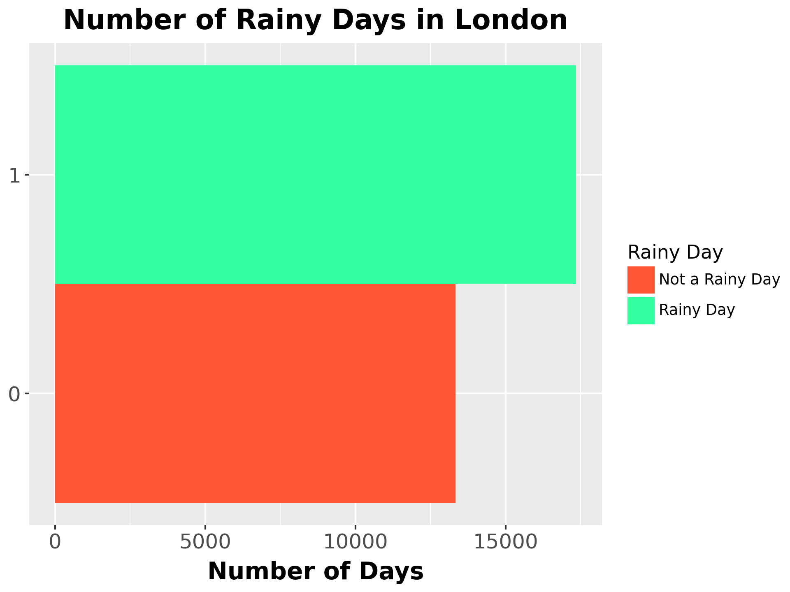

# Rubber Ducks 🦆 weather analysis project

Authors: Oliver Gregory, Sofia Giorgianni, Noemie Dunand-Wisdom

# What is our project about?

### "_London is a rainy city._"

## Data Pipeline Diagram

<div class="mermaid">
flowchart LR
    A{open-meteo} --> L((open-meteo API Requests))
    L --> B[London Dataframe]
    L --> C[Bangkok Dataframe]
    L --> D[ ... ]
    L --> E[Hong Kong Dataframe]
    G{top 20 cities website} -->|scraping| H(python list of 20 cities)
    I{OpenStreetMaps} --> J((OSM API request))
    H --> J
    J --> K(python list of dictionaries for coordinates of all cities)
    K --> L
    B --> M[Weather Dataframe:<br>each row is a time and city]
    C --> M
    D --> M
    E --> M
    M -.- F(save as .csv files)
    N{Google NGRAMS} --> S(json format)
    S -->|scraping| T[dataframe of appearance % for each query]
    T --> |sum by years| U[NGRAMS Dataframe]
    U -.- F
    M --> V[Final SQL Database]
    U --> V
    V -->|Data manipulation| O(London Visualisations)
    V -->|Data manipulation| Q(Descriptive Visualisations)
    V -->|Data manipulation| R(More Complex and Interactive Visualisations)
</div>

# How did we get our data?

## Scraping the 20 most visited cities
```python
import requests
from scrapy import Selector
cities_url = "https://travelness.com/most-visited-cities-in-the-world" # URL of the page with the list of cities

response = requests.get(cities_url)
sel = Selector(response)

cities = sel.xpath("//table//tr/td[2]/text()").getall()
```

This returns a list of the top 20 most visited cities:

```
['Bangkok', 'Paris', 'London', 'Dubai', 'Singapore', 'Kuala Lumpur', 'New York', 'Istanbul', 'Tokyo', 'Antalya', 'Seoul', 'Osaka', 'Makkah', 'Phuket', 'Pattaya', 'Milan', 'Barcelona', 'Palma de Mallorca', 'Bali', 'Hong Kong SAR']
```

## Geocoding the cities
The open-meteo API requires that we input coordinates and so we first had to take the city names and geocode them using the OpenStreetMaps API.
```python
from geopy.geocoders import Nominatim

def geocode_city(city):
    geolocator = Nominatim(user_agent="my_geocoder")
    location = geolocator.geocode(city)
    return {"city": city, "latitude": location.latitude, "longitude": location.longitude}

def geocode_cities(city_list):
    geocoded_cities = [geocode_city(city) for city in city_list if geocode_city(city)]
    return geocoded_cities

# Geocode the list of cities
geocoded_cities = geocode_cities(cities)
```

## Geocoding the cities
This returns a list of dictionaries, here is one of the items as an example:
```
{"city": "Paris", "latitude": 48.8534951, "longitude": 2.3483915}
```
## Preparing the open-meteo API call
The open-meteo API takes in a dictionary of parameters.
```python
params = {
    "latitude": [city["latitude"] for city in geocoded_cities],
    "longitude": [city["longitude"] for city in geocoded_cities],
    "start_date": "1940-01-01",
    "end_date": "2023-12-31",
    "daily": daily_variables_of_interest,
}
```

## The actual API call
Here we use the code provided in the open-meteo API documentation to get a list of responses for each city.

```python
# Setup the Open-Meteo API client with cache and retry on error
cache_session = requests_cache.CachedSession('.cache', expire_after = -1)
retry_session = retry(cache_session, retries = 5, backoff_factor = 0.2)
openmeteo = openmeteo_requests.Client(session = retry_session)

url = "https://archive-api.open-meteo.com/v1/archive"
responses = openmeteo.weather_api(url, params=params)
```
## Transforming the data into our desired format
Once we retrieved our API responses, we had to manipulate them into a useable format as the actual API response is just a list of responses that look like this:
```
<openmeteo_sdk.WeatherApiResponse.WeatherApiResponse at 0x7fd78b1f7d30>
```
This is obviously not very useful...

## Open-meteo API documentation and example code
The open-meteo API does provide you with useable code for returning pandas dataframes for each city, but their code was not desirable for a few reasons:

- Returned a list of dataframes for each city.
- Each dataframe had no way of distinguishing it from the other dataframes meaning that if we merged them then we wouldn't know which datapoints correspond to which cities.

## How did we overcome this?
Using the documentation, we wrote a function that processes each response and adds the city name.

```python
import pandas as pd
import openmeteo_requests

def process_response(response, geocoded_cities, i):
    daily = response.Daily()
    temperature_2m_max = daily.Variables(0).ValuesAsNumpy()
    temperature_2m_min = daily.Variables(1).ValuesAsNumpy()
    temperature_2m_mean = daily.Variables(2).ValuesAsNumpy()
    daylight_duration = daily.Variables(3).ValuesAsNumpy()
    sunshine_duration = daily.Variables(4).ValuesAsNumpy()
    precipitation_sum = daily.Variables(5).ValuesAsNumpy()
    rain_sum = daily.Variables(6).ValuesAsNumpy()
    precipitation_hours = daily.Variables(7).ValuesAsNumpy()

    daily_data = {
        "date": pd.date_range(
            start=pd.to_datetime(daily.Time(), unit="s", utc=True),
            end=pd.to_datetime(daily.TimeEnd(), unit="s", utc=True),
            freq=pd.Timedelta(seconds=daily.Interval()),
            inclusive="left"
        ).date
    }

    daily_data["city"] = geocoded_cities[i]['city']
    daily_data["temperature_2m_max"] = temperature_2m_max
    daily_data["temperature_2m_min"] = temperature_2m_min
    daily_data["temperature_2m_mean"] = temperature_2m_mean
    daily_data["daylight_duration"] = daylight_duration
    daily_data["sunshine_duration"] = sunshine_duration
    daily_data["precipitation_sum"] = precipitation_sum
    daily_data["rain_sum"] = rain_sum
    daily_data["precipitation_hours"] = precipitation_hours

    return pd.DataFrame(data=daily_data)
```

Now we can merge the dataframes:

```python
dataframes_list = [cf.process_response(response, geocoded_cities, i) for i, response in enumerate(responses)]
merged_df = pd.concat(dataframes_list, ignore_index=True)
merged_df.to_csv("../data/weather_data.csv", index=False)
```

## Final Outcome
Dataframe with over 600,000 rows.

<div style="overflow-x: auto;">
<style scoped>
    .dataframe {
        font-size: 13px; /* Adjust font size */
    }
    .dataframe tbody tr th,
    .dataframe tbody tr td {
        padding: 6px; /* Adjust padding */
    }
    .dataframe tbody tr th:only-of-type {
        vertical-align: middle;
    }
    .dataframe tbody tr th {
        vertical-align: top;
    }
    .dataframe thead th {
        text-align: right;
    }
</style>
<table border="1" class="dataframe">
  <thead>
    <tr style="text-align: right;">
      <th></th>
      <th>date</th>
      <th>city</th>
      <th>temperature_2m_max</th>
      <th>temperature_2m_min</th>
      <th>temperature_2m_mean</th>
      <th>daylight_duration</th>
      <th>sunshine_duration</th>
      <th>precipitation_sum</th>
      <th>rain_sum</th>
      <th>precipitation_hours</th>
    </tr>
  </thead>
  <tbody>
    <tr>
      <th>0</th>
      <td>1940-01-01</td>
      <td>Bangkok</td>
      <td>27.061001</td>
      <td>14.711</td>
      <td>20.571415</td>
      <td>40775.191406</td>
      <td>NaN</td>
      <td>NaN</td>
      <td>NaN</td>
      <td>0.0</td>
    </tr>
    <tr>
      <th>1</th>
      <td>1940-01-02</td>
      <td>Bangkok</td>
      <td>26.961000</td>
      <td>14.111</td>
      <td>20.248503</td>
      <td>40786.789062</td>
      <td>38087.828125</td>
      <td>0.0</td>
      <td>0.0</td>
      <td>0.0</td>
    </tr>
    <tr>
      <th>2</th>
      <td>1940-01-03</td>
      <td>Bangkok</td>
      <td>26.261000</td>
      <td>13.911</td>
      <td>19.719332</td>
      <td>40799.343750</td>
      <td>38101.910156</td>
      <td>0.0</td>
      <td>0.0</td>
      <td>0.0</td>
    </tr>
    <tr>
      <th>3</th>
      <td>1940-01-04</td>
      <td>Bangkok</td>
      <td>27.961000</td>
      <td>14.161</td>
      <td>20.523499</td>
      <td>40812.839844</td>
      <td>38117.046875</td>
      <td>0.0</td>
      <td>0.0</td>
      <td>0.0</td>
    </tr>
    <tr>
      <th>4</th>
      <td>1940-01-05</td>
      <td>Bangkok</td>
      <td>28.661001</td>
      <td>14.211</td>
      <td>21.300581</td>
      <td>40827.265625</td>
      <td>38133.210938</td>
      <td>0.0</td>
      <td>0.0</td>
      <td>0.0</td>
    </tr>
    <tr>
      <th>5</th>
      <td>1940-01-06</td>
      <td>Bangkok</td>
      <td>29.911001</td>
      <td>15.361</td>
      <td>22.540167</td>
      <td>40842.601562</td>
      <td>38150.390625</td>
      <td>0.0</td>
      <td>0.0</td>
      <td>0.0</td>
    </tr>
    <tr>
      <th>6</th>
      <td>1940-01-07</td>
      <td>Bangkok</td>
      <td>30.261000</td>
      <td>15.461</td>
      <td>22.473501</td>
      <td>40858.835938</td>
      <td>38168.574219</td>
      <td>0.0</td>
      <td>0.0</td>
      <td>0.0</td>
    </tr>
    <tr>
      <th>7</th>
      <td>1940-01-08</td>
      <td>Bangkok</td>
      <td>30.961000</td>
      <td>16.961</td>
      <td>23.983917</td>
      <td>40875.949219</td>
      <td>38187.718750</td>
      <td>0.0</td>
      <td>0.0</td>
      <td>0.0</td>
    </tr>
    <tr>
      <th>8</th>
      <td>1940-01-09</td>
      <td>Bangkok</td>
      <td>30.961000</td>
      <td>17.511</td>
      <td>24.306831</td>
      <td>40893.960938</td>
      <td>38207.929688</td>
      <td>0.0</td>
      <td>0.0</td>
      <td>0.0</td>
    </tr>
    <tr>
      <th>9</th>
      <td>1940-01-10</td>
      <td>Bangkok</td>
      <td>30.561001</td>
      <td>19.361</td>
      <td>24.577669</td>
      <td>40913.089844</td>
      <td>37394.550781</td>
      <td>0.0</td>
      <td>0.0</td>
      <td>0.0</td>
    </tr>
  </tbody>
</table>
</div>

Summary statistics for London data:

```python
merged_df[merged_df['city']=='London'].describe()
```

<div style="overflow-x: auto;">
<style scoped>
    .dataframe {
        font-size: 13px; /* Adjust font size */
    }
    .dataframe tbody tr th,
    .dataframe tbody tr td {
        padding: 6px; /* Adjust padding */
    }
    .dataframe tbody tr th:only-of-type {
        vertical-align: middle;
    }
    .dataframe tbody tr th {
        vertical-align: top;
    }
    .dataframe thead th {
        text-align: right;
    }
</style>
<table border="1" class="dataframe">
  <thead>
    <tr style="text-align: right;">
      <th></th>
      <th>temperature_2m_max</th>
      <th>temperature_2m_min</th>
      <th>temperature_2m_mean</th>
      <th>daylight_duration</th>
      <th>sunshine_duration</th>
      <th>precipitation_sum</th>
      <th>rain_sum</th>
      <th>precipitation_hours</th>
    </tr>
  </thead>
  <tbody>
    <tr>
      <th>count</th>
      <td>30681.000000</td>
      <td>30681.000000</td>
      <td>30681.000000</td>
      <td>30681.000000</td>
      <td>30680.000000</td>
      <td>30680.000000</td>
      <td>30680.000000</td>
      <td>30681.000000</td>
    </tr>
    <tr>
      <th>mean</th>
      <td>13.774742</td>
      <td>6.729281</td>
      <td>10.306868</td>
      <td>44177.980469</td>
      <td>25653.326172</td>
      <td>1.691261</td>
      <td>1.642960</td>
      <td>3.851146</td>
    </tr>
    <tr>
      <th>std</th>
      <td>6.194537</td>
      <td>5.271986</td>
      <td>5.609030</td>
      <td>10799.614258</td>
      <td>16077.271484</td>
      <td>3.265338</td>
      <td>3.221255</td>
      <td>5.007728</td>
    </tr>
    <tr>
      <th>min</th>
      <td>-6.454500</td>
      <td>-15.904500</td>
      <td>-8.721166</td>
      <td>28170.857422</td>
      <td>0.000000</td>
      <td>0.000000</td>
      <td>0.000000</td>
      <td>0.000000</td>
    </tr>
    <tr>
      <th>25%</th>
      <td>9.195499</td>
      <td>2.795500</td>
      <td>6.139249</td>
      <td>33813.128906</td>
      <td>12710.077148</td>
      <td>0.000000</td>
      <td>0.000000</td>
      <td>0.000000</td>
    </tr>
    <tr>
      <th>50%</th>
      <td>13.745500</td>
      <td>6.995500</td>
      <td>10.437167</td>
      <td>44288.531250</td>
      <td>25880.933594</td>
      <td>0.200000</td>
      <td>0.200000</td>
      <td>1.000000</td>
    </tr>
    <tr>
      <th>75%</th>
      <td>18.545500</td>
      <td>10.945499</td>
      <td>14.853833</td>
      <td>54571.656250</td>
      <td>38797.984375</td>
      <td>1.900000</td>
      <td>1.800000</td>
      <td>7.000000</td>
    </tr>
    <tr>
      <th>max</th>
      <td>37.952000</td>
      <td>20.851999</td>
      <td>29.131165</td>
      <td>59899.007812</td>
      <td>55052.890625</td>
      <td>39.900002</td>
      <td>39.900002</td>
      <td>24.000000</td>
    </tr>
  </tbody>
</table>
</div>

## Google NGRAMS
Adding to our analysis the perception of London as a rainy city through literature
Scraping method:

- Transformed the Google NGRAM graphs into json format.
- Create a dataframe for each query and merge them.
- For analysis purposes, we summed the frequencies to give a general idea of the perception per year.

|   | Year | Appearence %    |
|---|------|-----------------|
| 0 | 1940 | 2.731485e-09    |
| 1 | 1941 | 2.756745e-09    |
| 2 | 1942 | 2.743879e-09    |
| 3 | 1943 | 2.774656e-09    |
| 4 | 1944 | 2.788329e-09    |

## Next steps
- Store the data as a database.
- Adjust the datatypes of each column to be most appropriate and efficient because 6,000,000 pieces of data is a lot.

# What have we found so far?








### Thanks for listening 🦆.
